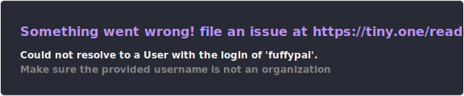

# 🪄 Welcome to my Soft World! ｡◕‿◕｡

<p align="center">
  
</p>

<div align="center">
  
  
  
</div>

<br>

<div align="center">
  <p>
    Hi, I'm <b>Flaouve</b>! (>.<)<br>
    I grab whichever language I need and work my <b>Magic</b> on the screen,<br>
    all while being that <i>femboy soul</i> chilling in my own soft world! ⸝⸝ᵕᴗᵕ⸝⸝
  </p>
</div>

---

### 🌙 The Essence of My Code

> Whenever I hear something illogical, my brain goes straight into **'disconnect'** mode; 
> because I’m not about empty seriousness, I’m a person of deep meanings and lo-fi vibes... ¶.¶

- 🎹 **Inspiration:** Piano keys blending with subtle Violin rhythms.
- ✨ **Touch:** Every line is reflected with an aesthetic, magical touch.
- 🛠 **Tools:** Polyglot mindset—if I need it, I master it.

---
### 🪄 My Magic Mirror (Stats)


---

### 🎵 Curating Vibes...
```text
  0:45 ───ㅇ───── 3:12
      ↻ ◁ II ▷ ↺
  Volume: ■■■■■■■□
  Now Playing: Soft Piano & Violin Lofi Mix
